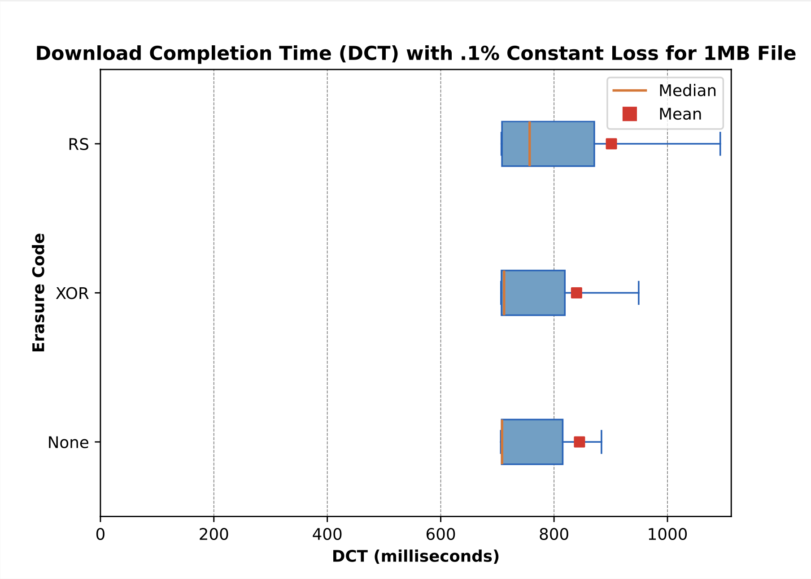
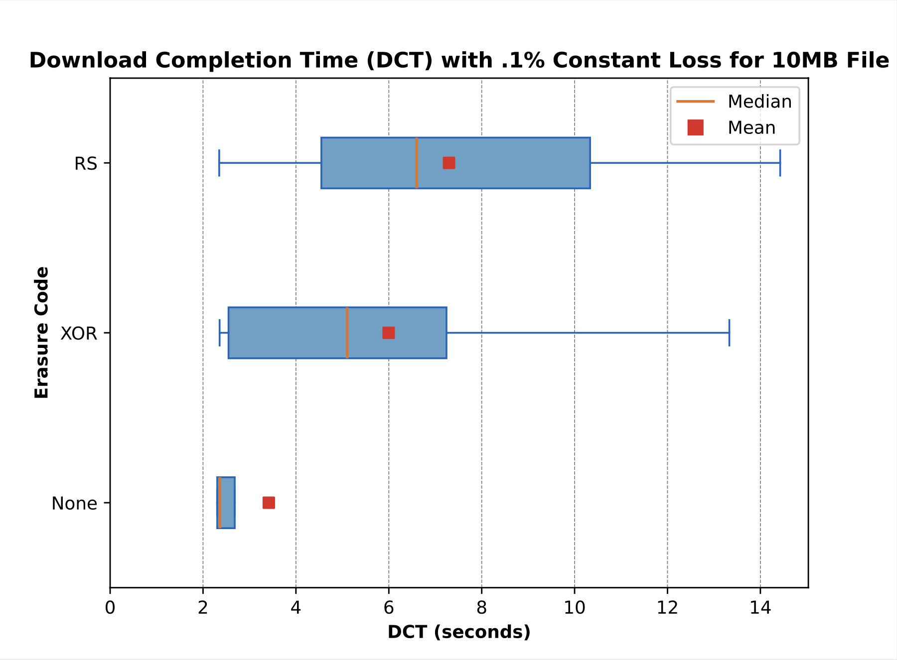
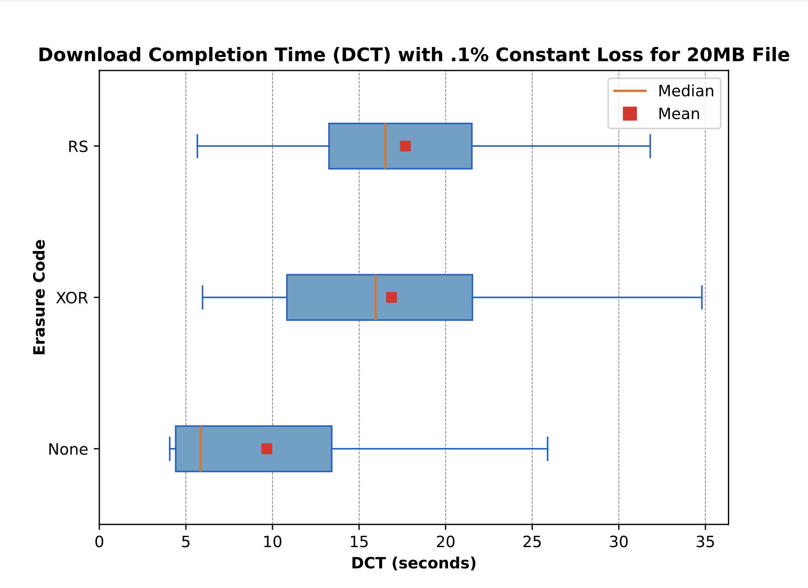
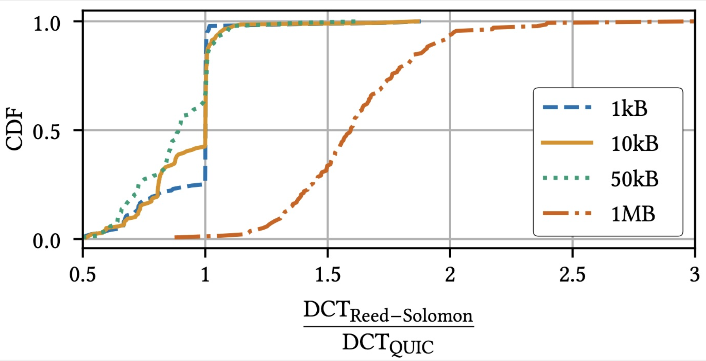

# Implementing Forward Erasure Correction into quic-go

QUIC[^1] is a new general-purpose transport protocol, first standardized by the Internet Engineering Task Force (IETF) in 2021, which combines features from mature protocols such as TCP[^2], UDP[^3], and TLS[^4]. QUIC differentiates itself by offering secure connections by default, promises fewer round trips before data is transmitted, fixes the head-of-line blocking present with TCP, and is made to support a broad array of
transport services. Hypertext Transfer Protocol Version 3.0 (HTTP/3)[^5], which is the newest version of the Hypertext Transfer Protocol (HTTP) and is the most popular application-level protocol built upon QUIC, is now used by 8.2% of all websites[^6]. As QUIC increases in usage, it is critical to find ways in order to improve its performance amongst different classes of applications. IFC services, which see use within the context of airplane Wi-Fi by means of satellite or base station connectivity, offer a unique value proposition for QUIC due to their steady growth[^7], high-delays, and lossy nature[^8]. A consequence of such a network is many retransmissions, which is the default loss-recovery mechanism of QUIC and includes the downside of a degraded user experience. However, by taking advantage of QUIC’s extensibility, it is possible to introduce new types of loss recovery mechanisms, which may better suit such networks. FEC is one such mechanism, which trades bandwidth for redundancy in the attempt to reduce the
need for retransmissions, thereby increasing the quality of the connection. In this project, we investigate the performance of FEC relative to the pre-existing retransmission-only based loss recovery mechanism by extending the quic-go repository[^9] and running simulated network tests with conditions that mimic IFC networks.

For our experiments, we used a client-server file-download scenario. On each interface, we used netem to control the bandwidth, loss rate, and latency with values of 50Mbit/s, .1%, and 50ms, respectively. These values were chosen due to being within the range of Starlink network conditions as shown by Mohan et al.[^10]. Each test was repeated 50 times. Seen in the figures below are the file download times from 1MB, 10MB, and 20MB files, respectively. The trend derived from these figures is that the larger the file size, the larger the discrepancy is between the median times of retransmission-only QUIC and FEC-based QUIC. This result can largely be attributed to the fact that in addition to the 1.5x overhead caused from the two-thirds coding rate, a large amount of spurious retransmissions occur. This is because with a packet-based loss detection threshold of 3 packets as defined in the QUIC loss recovery document[^11], spurious retransmission may commonly occur as the packet has been recovered too late. Consequently, this partly explains why the 10MB example has less of a discrepancy between FEC and non-FEC versions as there is simply less time for spurious retransmissions to occur. Another reason may also be because algorithms like slow-start play outsized roles during very short connections and overshadow the impacts of FEC. Although disappointing, these results are consistent with those from François Michel as seen in the figure below. Using network conditions derived from Rula et al.[^8], Michel also showed how small file sizes showed less of a median DCT discrepancy than with larger files.









[^1]: [RFC 9000](https://www.rfc-editor.org/info/rfc9000)
[^2]: [RFC 791](https://www.rfc-editor.org/info/rfc791)
[^3]: [RFC 768](https://www.rfc-editor.org/info/rfc768)
[^4]: [RFC 8446](https://www.rfc-editor.org/info/rfc8446)
[^5]: [RFC 9114](https://www.rfc-editor.org/info/rfc9114)
[^6]: [QUIC Usage Statistics](https://w3techs.com/technologies/details/ce-quic)
[^7]: [In-Flight Wi-Fi Strategic Business Report 2023-2030](https://www.globenewswire.com/news-release/2024/09/03/2939792/28124/en/In-Flight-Wi-Fi-Strategic-Business-Report-2023-2030-Airlines-Connectivity-and-Content-Provider-Collaborations-Take-the-Market-to-New-Heights.html)
[^8]: [Research Paper on IFC Networks](https://doi.org/10.1145/3178876.3186057)
[^9]: [quic-go GitHub Repository](https://github.com/quic-go/quic-go)
[^10]: [Starlink measurements](http://dx.doi.org/10.1145/3589334.3645328)
[^11]: [RFC 9002](https://www.rfc-editor.org/info/rfc9002)

## Using QUIC

### Running a Server

The central entry point is the `quic.Transport`. A transport manages QUIC connections running on a single UDP socket. Since QUIC uses Connection IDs, it can demultiplex a listener (accepting incoming connections) and an arbitrary number of outgoing QUIC connections on the same UDP socket.

```go
udpConn, err := net.ListenUDP("udp4", &net.UDPAddr{Port: 1234})
// ... error handling
tr := quic.Transport{
  Conn: udpConn,
}
ln, err := tr.Listen(tlsConf, quicConf)
// ... error handling
go func() {
  for {
    conn, err := ln.Accept()
    // ... error handling
    // handle the connection, usually in a new Go routine
  }
}()
```

The listener `ln` can now be used to accept incoming QUIC connections by (repeatedly) calling the `Accept` method (see below for more information on the `quic.Connection`).

As a shortcut,  `quic.Listen` and `quic.ListenAddr` can be used without explicitly initializing a `quic.Transport`:

```
ln, err := quic.Listen(udpConn, tlsConf, quicConf)
```

When using the shortcut, it's not possible to reuse the same UDP socket for outgoing connections.

### Running a Client

As mentioned above, multiple outgoing connections can share a single UDP socket, since QUIC uses Connection IDs to demultiplex connections.

```go
ctx, cancel := context.WithTimeout(context.Background(), 3*time.Second) // 3s handshake timeout
defer cancel()
conn, err := tr.Dial(ctx, <server address>, <tls.Config>, <quic.Config>)
// ... error handling
```

As a shortcut, `quic.Dial` and `quic.DialAddr` can be used without explictly initializing a `quic.Transport`:

```go
ctx, cancel := context.WithTimeout(context.Background(), 3*time.Second) // 3s handshake timeout
defer cancel()
conn, err := quic.Dial(ctx, conn, <server address>, <tls.Config>, <quic.Config>)
```

Just as we saw before when used a similar shortcut to run a server, it's also not possible to reuse the same UDP socket for other outgoing connections, or to listen for incoming connections.

### Using a QUIC Connection

#### Accepting Streams

QUIC is a stream-multiplexed transport. A `quic.Connection` fundamentally differs from the `net.Conn` and the `net.PacketConn` interface defined in the standard library. Data is sent and received on (unidirectional and bidirectional) streams (and, if supported, in [datagrams](#quic-datagrams)), not on the connection itself. The stream state machine is described in detail in [Section 3 of RFC 9000](https://datatracker.ietf.org/doc/html/rfc9000#section-3).

Note: A unidirectional stream is a stream that the initiator can only write to (`quic.SendStream`), and the receiver can only read from (`quic.ReceiveStream`). A bidirectional stream (`quic.Stream`) allows reading from and writing to for both sides.

On the receiver side, streams are accepted using the `AcceptStream` (for bidirectional) and `AcceptUniStream` functions. For most user cases, it makes sense to call these functions in a loop:

```go
for {
  str, err := conn.AcceptStream(context.Background()) // for bidirectional streams
  // ... error handling
  // handle the stream, usually in a new Go routine
}
```

These functions return an error when the underlying QUIC connection is closed.

#### Opening Streams

There are two slightly different ways to open streams, one synchronous and one (potentially) asynchronous. This API is necessary since the receiver grants us a certain number of streams that we're allowed to open. It may grant us additional streams later on (typically when existing streams are closed), but it means that at the time we want to open a new stream, we might not be able to do so.

Using the synchronous method `OpenStreamSync` for bidirectional streams, and `OpenUniStreamSync` for unidirectional streams, an application can block until the peer allows opening additional streams. In case that we're allowed to open a new stream, these methods return right away:

```go
ctx, cancel := context.WithTimeout(context.Background(), 5*time.Second)
defer cancel()
str, err := conn.OpenStreamSync(ctx) // wait up to 5s to open a new bidirectional stream
```

The asynchronous version never blocks. If it's currently not possible to open a new stream, it returns a `net.Error` timeout error:

```go
str, err := conn.OpenStream()
if nerr, ok := err.(net.Error); ok && nerr.Timeout() {
  // It's currently not possible to open another stream,
  // but it might be possible later, once the peer allowed us to do so.
}
```

These functions return an error when the underlying QUIC connection is closed.

### Configuring QUIC

The `quic.Config` struct passed to both the listen and dial calls (see above) contains a wide range of configuration options for QUIC connections, incl. the ability to fine-tune flow control limits, the number of streams that the peer is allowed to open concurrently, keep-alives, idle timeouts, and many more. Please refer to the documentation for the `quic.Config` for details.

The `quic.Transport` contains a few configuration options that don't apply to any single QUIC connection, but to all connections handled by that transport. It is highly recommend to set the `StatelessResetToken`, which allows endpoints to quickly recover from crashes / reboots of our node (see [Section 10.3 of RFC 9000](https://datatracker.ietf.org/doc/html/rfc9000#section-10.3)).

## Using HTTP/3

### As a server

See the [example server](example/main.go). Starting a QUIC server is very similar to the standard library http package in Go:

```go
http.Handle("/", http.FileServer(http.Dir(wwwDir)))
http3.ListenAndServeQUIC("localhost:4242", "/path/to/cert/chain.pem", "/path/to/privkey.pem", nil)
```

### As a client

See the [example client](example/client/main.go). Use a `http3.RoundTripper` as a `Transport` in a `http.Client`.

```go
http.Client{
  Transport: &http3.RoundTripper{},
}
```

## Supported RFCs

quic-go is an implementation of the QUIC protocol ([RFC 9000](https://datatracker.ietf.org/doc/html/rfc9000), [RFC 9001](https://datatracker.ietf.org/doc/html/rfc9001), [RFC 9002](https://datatracker.ietf.org/doc/html/rfc9002)) in Go. It has support for HTTP/3 ([RFC 9114](https://datatracker.ietf.org/doc/html/rfc9114)), including QPACK ([RFC 9204](https://datatracker.ietf.org/doc/html/rfc9204)).

In addition to these base RFCs, it also implements the following RFCs: 
* Unreliable Datagram Extension ([RFC 9221](https://datatracker.ietf.org/doc/html/rfc9221))
* Datagram Packetization Layer Path MTU Discovery (DPLPMTUD, [RFC 8899](https://datatracker.ietf.org/doc/html/rfc8899))
* QUIC Version 2 ([RFC 9369](https://datatracker.ietf.org/doc/html/rfc9369))
* QUIC Event Logging using qlog ([draft-ietf-quic-qlog-main-schema](https://datatracker.ietf.org/doc/draft-ietf-quic-qlog-main-schema/) and [draft-ietf-quic-qlog-quic-events](https://datatracker.ietf.org/doc/draft-ietf-quic-qlog-quic-events/))
